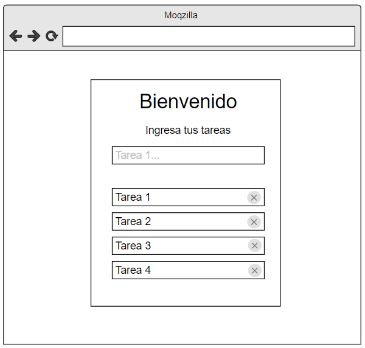

# React + Vite

This template provides a minimal setup to get React working in Vite with HMR and some ESLint rules.

## Trabajo Práctico React

### Ejercicio 4

4. Lista de tareas - Dificultad: 🟢

Crear una aplicación web que muestre una lista de tareas, al ingresar una tarea en el input y presionar enter, esta tarea se debe mostrar en una lista como la imagen a continuación:



---

Utilizamos [React-Bootstrap](https://react-bootstrap.netlify.app/) **v2.9.0** en nuestro proyecto para incoroporar el Container, y usamos el **"bootstrap/dist/css/bootstrap.min.css"** para utilizar los estilos de Bootstrap.

> **IMPORTANTE:** Para ambos casos tenemos que importar estas herramientas con el **import**.

---

Además utilizamos el objeto props para mandar información desde un Componente padre (**App.jsx**) a un los Componentes hijos.

Utilizamos un HOOK que es una función que le da habilidades extras a mi functionalComponent, una de esas es el Estado.

> 📌 useState es el nombre del Hook.

### Explicación 📓📄

Para crear ese state, creo una constante:

const[tarea, setTarea] = useState("");

Me invento una palabra para el estado. Por ej quiero controlar el input, en el input voy a cargar una tarea, así que le pongo de nombre "tarea" a mi State y luego pongo setTarea, con esto me da a entender que esto sirve para modificar una tarea.

Entre ( ) vamos a poner el valor con el que arrancaría tarea y en este caso quiero que inicialice con string vacío.

Entonces el state este que creamos que se llama tarea sirve para controlar el input, por la recomendación de React que cada elemento del formulario estará asociado a un State.
Pero esa tarea luego la voy a guardar dentro del Array cuando aprete el botón de Agregar.

El objetivo es que a medida que vaya agregando tareas, automáticamente el componente de abajo que es la Lista me vaya mostrando las tareas, se me renderice la nueva fila con la tarea que acabo de agregar en el Array.

El State promete que si yo guardo en ese lugar, él se va a encargar de renderizarlo si yo le agrego o modifico elementos. Para que haga eso tengo que guardar el Array en un estado y no en una variable normal que haya creado con JS, ahí React no promete renderizar automáticamente para mí, por eso usamos un State.

Entonces quiero guardar un Array dentro de otro State.

    const [listaTareas, setListaTareas] = useState([]);

Entonces mi otro State que acabo de crear se llama listaTareas, setListaTareas es la función que va a actualizar listaTareas y a este lo inicializamos como una Array vacío.

Ahí le estamos diciendo a React que este estado va a almacenar un Array de tareas.

### Repositorio 💻

Los ejercicios se encuentran en el sgte. repositorio:
https://github.com/EmiTorres93/RCS-43i-React_exercise3

- Para clonar el Repositorio:

```bash
git clone https://github.com/EmiTorres93/RCS-43i-projectReact
```

- Para contribuir con el proyecto ponerse en contacto con el sgte. mail: **emiliana.mt93@gmail.com**

## Autores

1. Emiliana M. Torres [GitHub](https://github.com/EmiTorres93)
